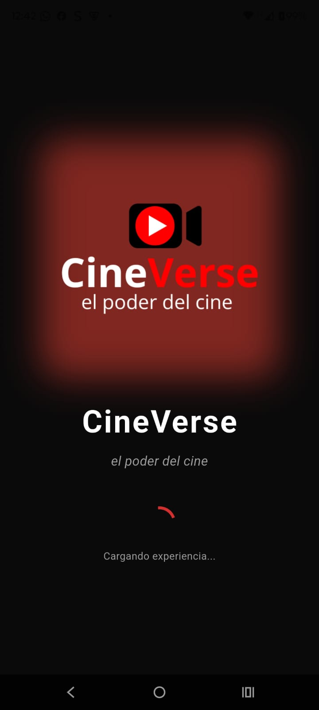
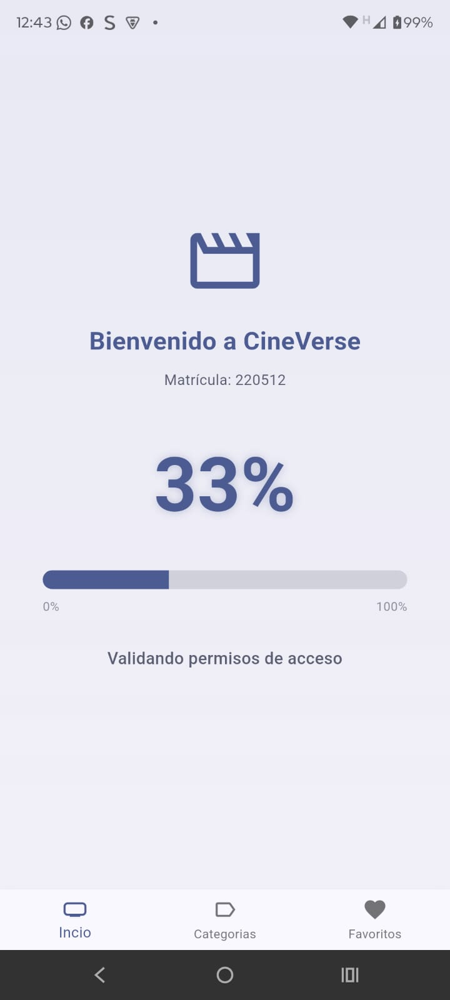
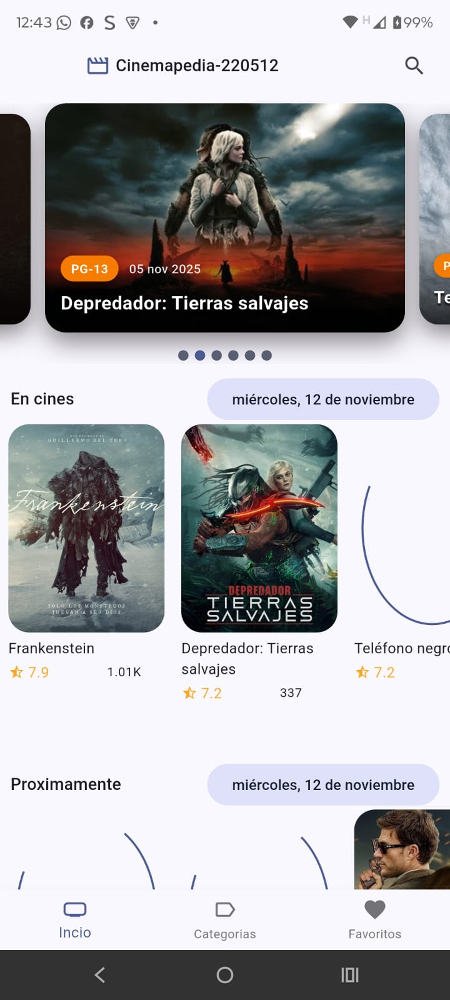
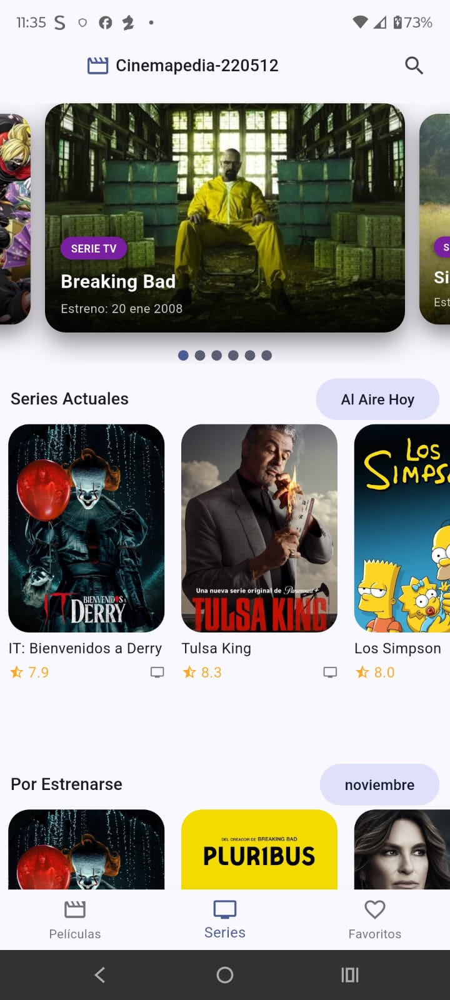
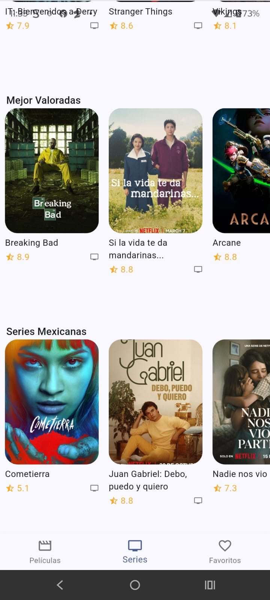

# 🧾 Reporte de Avance — Examen Práctico Unidad 2  
**Asignatura:** Desarrollo Móvil Integral  
**Proyecto:** Aplicación *Cinemapedia*  
**Periodo:** Contingencia Climática — Trabajo Autónomo  
**Fecha de entrega:** Jueves 14 de noviembre de 2025  
**URL Repositorio:** https://github.com/MendezPro/DMI_ExamenPractico_U2_220512

---

## 📅 1. Contexto
Durante la suspensión de actividades presenciales por contingencia climática, se realizó trabajo autónomo y asistido con Inteligencia Artificial para continuar con el desarrollo del examen práctico de la Unidad 2.  
Este reporte documenta las acciones realizadas, los commits efectuados, y las evidencias visuales correspondientes.

---

## 👤 2. Información General del Estudiante
- **Nombre completo:** Orlando Mendez Montes
- **Matrícula:** 220512
- **Grupo:** Decimo "B"
- **Repositorio privado:** https://github.com/MendezPro/DMI_ExamenPractico_U2_220512
- **Versión actual:** `v1.0-examen`
- **Último commit registrado:** `docs: actualizar README con reporte de avance completol`

---

## 🚀 3. Actividades Desarrolladas Durante la Contingencia

| Fecha | Actividad | Descripción breve | Evidencia |
|:------|:-----------|:------------------|:-----------|
| 12/11/2025 | Creación del repositorio | Se cargó la práctica base (Práctica 05) y se configuró la API TMDB. Se inicializó Git y se subió al repositorio remoto. | Commit inicial + Captura 1 |
| 12/11/2025 | Implementación del Splash Screen | Se creó SplashScreen con animación FadeIn/ZoomIn usando animate_do, imagen de splash vertical y reproductor de audio con audioplayers. Se configuró navegación automática a HomeScreen después de 3 segundos. | Commit de Splash Screen + Captura 2 |
| 12/11/2025 | Pantalla de carga progresiva | Se rediseñó FullscreenLoader mostrando porcentaje numérico (0%-100%) con LinearProgressIndicator animado. El progreso incrementa sincronizado con mensajes de carga de cada provider. Incluye diseño moderno con gradientes y colores de tema. | Commit de Loading Screen + Captura 3 |
| 12/11/2025 | Ajustes visuales en Swiper | Se agregaron al Swiper: título de película, fecha de estreno formateada con intl, píldora (pill) visual con clasificación (P, PG, PG-13, R) con colores diferenciados, y gradiente de sombreado para mejor legibilidad del texto sobre las imágenes. | Commit de Swiper mejorado + Captura 4 |
| 16/11/2025 | Correcciones finales de películas | Se corrigió el ordenamiento de películas mexicanas por fecha de estreno descendente, se quitó el subtítulo de la sección Populares, y se implementó filtro de mes actual para películas Upcoming con fecha de estreno en lugar de rating/popularidad. | Commit de correcciones |
| 16/11/2025 | Implementación completa de Series | Se creó toda la arquitectura para series de TV: entidades, datasources, repositories, mappers, providers, widgets (slidershow y horizontal listview), pantalla completa con 5 secciones (Actuales, Por Estrenarse, Populares, Mejor Valoradas, Mexicanas), y navegación funcional en BottomNavigationBar. | Commit de series completas |

---

## 💾 4. Historial de Commits Relevantes

| Commit | Mensaje | Fecha |
|:--------|:----------|:-------|
| `Realizado` | feat: implementar splash screen con animación y audio | 12/11/2025 |
| `Realizado` | feat: implementar loading screen progresivo con porcentaje | 12/11/2025 |
| `Realizado` | feat: mejorar swiper con título, fecha y clasificación | 12/11/2025 |
| `Realizado` | docs: actualizar README con reporte de avance completo | 12/11/2025 |
| `Realizado` | fix: corregir secciones de películas (Popular, Mexicanas, Upcoming) | 16/11/2025 |
| `Realizado` | feat: implementar sección completa de Series TV con navegación | 16/11/2025 |
| `Realizado` | chore: generar iconos de launcher para todas las plataformas | 16/11/2025 |

---

## 🖼️ 5. Evidencias Visuales

| Evidencia | Descripción | Imagen |
|:------------|:-------------|:--------|
| Splash Screen | Animación inicial con logo, efecto FadeIn/ZoomIn y reproductor de audio |  |
| Loading Screen | Indicador porcentual de carga (0-100%) con barra de progreso animada |  |
| Swiper Principal | Muestra título, fecha de estreno y píldora de clasificación con sombreado |  |
| Pantalla Series TV | Sección completa de series con múltiples categorías: Actuales, Por Estrenarse, Populares, Mejor Valoradas y Series Mexicanas |  |
| Categorías de Series | Vista detallada mostrando los diferentes grupos de series organizados por categoría con ratings y posters |  |

> 📌 **NOTA:** Capturas de pantalla incluidas en el repositorio.

---

## 🤖 6. Uso de Inteligencia Artificial

### Tareas realizadas con asistencia de IA:
- Implementación completa del **SplashScreen** con animaciones usando animate_do
- Configuración de **audioplayers** para reproducir audio de bienvenida
- Rediseño del **FullscreenLoader** con porcentaje progresivo
- Mejoras visuales del **Swiper** con overlay de información
- Creación de píldoras visuales con colores por clasificación
- Formateo de fechas con intl en español
- Redacción de documentación técnica

Toda la evidencia de prompts y resultados se encuentra en el documento [Evidencia.md](imgs/Evidencia.md) incluido en el repositorio.

---

## 🧭 7. Próximas Acciones
- [✔️ ] Integrar animación con Lottie en el Splash.  
- [ ] Completar la sección de Series Populares.  
- [ ] Documentar dependencias nuevas en el README.  
- [ ] Grabar video corto mostrando la aplicación funcional.  

> 🔹 *Marca con “✔️” las tareas completadas.*

---

## 💬 8. Conclusión Personal

Durante este periodo en el cual hubo una breve contingencia climática, aprendí a trabajar de forma autónoma y organizada. La parte más desafiante fue sincronizar el porcentaje de carga con los providers de Riverpod. Con ayuda de la Inteligencia Artificial logré implementar funcionalidades complejas como el Splash Screen animado con audio, el Loading Screen progresivo con porcentaje visual, y las mejoras del Swiper con información contextual de las películas. Antes de que sea la entrega final planeo implementar la sección completa de Series de TV y refinar los filtros de películas según los requisitos del examen.

---

**📍 Última actualización:** 12 de noviembre de 2025
**👨‍💻 Desarrollador:** Orlando Mendez Montes (220512)
